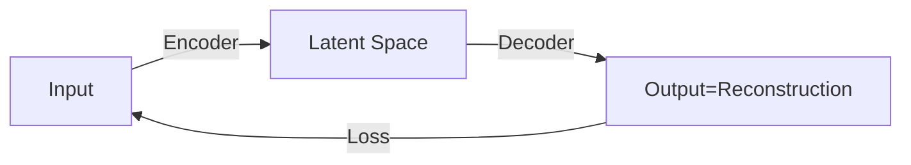

# Representation Learning

In this project, we explore autoencoders and variational autoencoders for representation learning. We use the MNIST dataset and the CIFAR-10 dataset to train and evaluate the models. 

## Autoencoders

The encoder and the decoder can be implemented using fully connected layers or convolutional layers.

